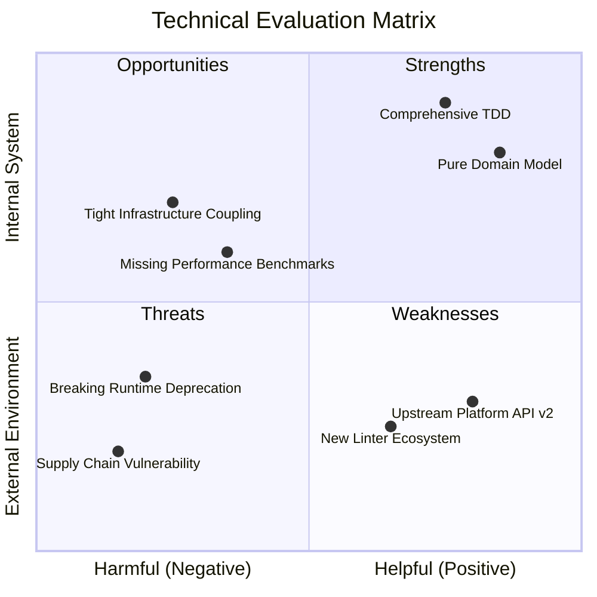

# SWOT Methodology & Evaluation Rubric

This reference defines classification criteria, evidence grounding standards, scoring rubrics, strategic formulation frameworks, and visual chart conventions for technical SWOT evaluations.

---

## 1. Quadrant Classification Criteria

Evaluate findings against two orthogonal axes:
- **Origin**: Internal (attributes of the system/codebase/skill) vs. External (attributes of the environment/ecosystem/upstream platforms).
- **Impact**: Helpful (positive, value-generating) vs. Harmful (negative, risk-inducing).

| Quadrant | Origin | Impact | Technical Focus Areas |
| :--- | :--- | :--- | :--- |
| **Strengths (S)** | Internal | Helpful | Modular architecture, high test coverage, clean abstractions, high performance, robust error handling, self-documenting code. |
| **Weaknesses (W)** | Internal | Harmful | Technical debt, missing test suites, tight coupling, leaky abstractions, dead code, missing validations, brittle dependencies. |
| **Opportunities (O)** | External | Helpful | Modern runtime features, standard library improvements, ecosystem integrations, reusable shared libraries, automation tooling. |
| **Threats (T)** | External | Harmful | Upstream breaking API changes, supply chain vulnerabilities, platform deprecations, hostile runtime constraints, external lock-in. |

---

## 2. Evidence Grounding Standards

Every point recorded in a SWOT matrix must be backed by verifiable repository artifacts:
- **Source Citations**: Cite concrete file paths, class names, functions, or line ranges.
- **Metric Verification**: Include test execution numbers, benchmark results, bundle sizes, or cyclomatic complexity.
- **Configuration Proof**: Point to manifest entries, CI workflow definitions, or package configurations.
- **No Speculation**: Discard unverified assumptions or subjective opinions not demonstrable from the code or ecosystem facts.

---

## 3. Scoring & Prioritization Rubric

To prioritize actions, assign scores (1 to 5) to each identified item:

### Attribute Scoring
- **Impact (1–5)**:
  - `5`: Critical architectural or operational effect.
  - `3`: Moderate efficiency or maintainability effect.
  - `1`: Cosmetic or minor convenience effect.
- **Urgency (1–5)**:
  - `5`: Requires immediate intervention or immediate exploitation.
  - `3`: Addressable within the next milestone.
  - `1`: Backlog consideration with no time pressure.
- **Feasibility / Effort (1–5)**:
  - `1`: Complex multi-component refactoring or significant effort.
  - `3`: Moderate single-component enhancement.
  - `5`: Quick win with minimal risk or effort.

### Priority Tier
Calculate Priority Index: `(Impact + Urgency) * (Feasibility / 2)`
- **P0 (Critical)**: Score >= 20. Immediate sprint action.
- **P1 (High)**: Score 12–19. Planned next iteration.
- **P2 (Medium/Low)**: Score < 12. Recorded in backlog or monitored.

---

## 4. TOWS Strategic Formulation Matrix

Translate passive quadrant observations into proactive engineering strategies:

```text
               +----------------------------------+----------------------------------+
               | Strengths (S)                    | Weaknesses (W)                   |
+--------------+----------------------------------+----------------------------------+
| Opportunities| SO Strategies (Maxi-Maxi):       | WO Strategies (Mini-Maxi):       |
| (O)          | Leverage internal strengths to   | Overcome internal weaknesses by  |
|              | seize external opportunities.    | adopting external opportunities. |
+--------------+----------------------------------+----------------------------------+
| Threats      | ST Strategies (Maxi-Mini):       | WT Strategies (Mini-Mini):       |
| (T)          | Deploy internal strengths to     | Mitigate internal weaknesses to  |
|              | defend against external threats. | guard against external threats.  |
+--------------+----------------------------------+----------------------------------+
```

---

## 5. Visual Mermaid Quadrant Chart Guide

When the host environment supports Mermaid charts, render a quadrant chart to summarize factor positioning:


