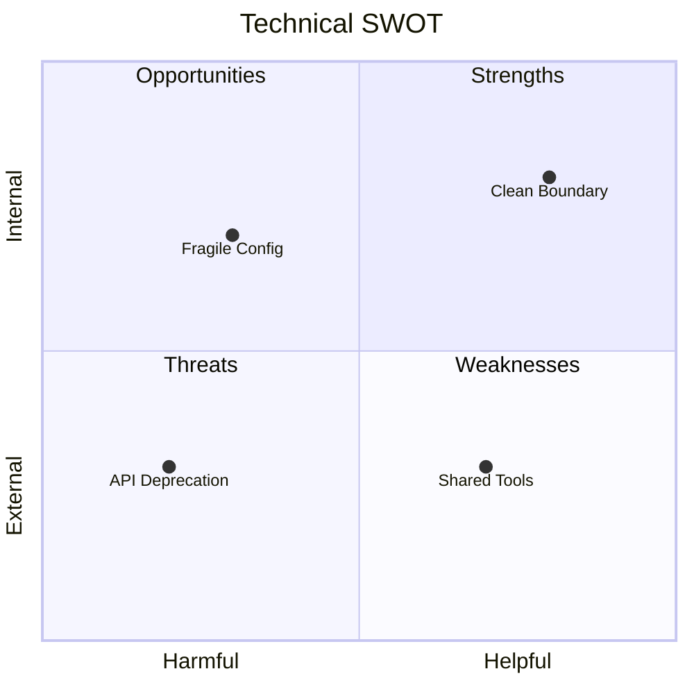

# SWOT Methodology & Evaluation Guidelines

This reference defines clear, low-ceremony criteria for evidence-grounded technical audits.

---

## 1. Quadrant Classification

Classify observations by origin and impact without ceremonial overhead:

| Quadrant | Focus | Goal |
| :--- | :--- | :--- |
| **Strengths (S)** | Working architectural patterns, solid tests, clean boundaries | Preserve and build upon |
| **Weaknesses (W)** | Tech debt, tight coupling, missing tests, fragile logic | Prioritize for cleanup |
| **Opportunities (O)** | Upstream features, reusable tools, standards adoption | Leverage for efficiency |
| **Threats (T)** | Breaking API changes, deprecations, platform constraints | Shield and mitigate |

---

## 2. Grounding Rules

To prevent speculative or ungrounded claims:
- **Cite Direct Evidence**: Every observation must reference an exact file path, test suite, or config line.
- **Avoid Speculation**: Discard hypothetical risks or subjective opinions not observable in code or active dependencies.
- **Keep Items Actionable**: Focus only on factors that lead to clear engineering decisions.

---

## 3. Practical Prioritization

Avoid artificial arithmetic formulas or complex scoring weights. Use standard engineering tiers:

- **P0 (Critical)**: Active blocker, breaking risk, or critical architecture defect.
- **P1 (High)**: High-leverage improvement or mitigation for the active milestone.
- **P2 (Medium/Low)**: Non-blocking polish or backlog item.

---

## 4. Optional Visual Chart

When visual summary is helpful and Mermaid is supported:

