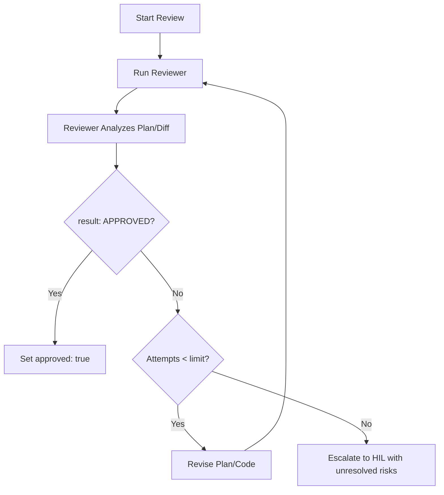

# Feedback Review & Escalation Protocol

This document details the bounded review loops used during the PLAN and REVIEW phases, along with escalation transitions for human-in-loop rejections and stalled autonomous work.

---

## 1. AFK Review Loop

In `afk` mode, the agent must not proceed without verifying the quality of the plan or implementation. Use a reviewer subagent when the runtime supports it; otherwise, run a separate review pass with fresh context and record the limitation.



### Protocol Guidelines
- **Reviewer Separation:** Use a dedicated reviewer subagent or a separate review pass that does not inherit the implementer's draft rationale.
- **Input:** Provide the brief, specification, selected guides, selected sensors, draft plan for PLAN review, or git diff and sensor results for REVIEW.
- **Output:** The reviewer must output a structured payload where `result` is evaluated:
  ```yaml
  result: APPROVED  # or REJECTED
  comments:
    - "Detail of concern 1"
  unresolved_risks: []
  ```
- **Attempt Limit:** Use `harness.sandbox.limits.max_correction_attempts` as the default review/correction limit unless the active plan specifies a stricter value.

### Stalemate Resolution

- **No Auto-Approval:** Do not set `approved: true` only to escape reviewer disagreement.
- **No Destructive Rollback:** Do not run destructive workspace commands such as hard reset or clean unless the human explicitly requested them.
- **Escalate with Evidence:** When the attempt limit is exhausted, switch `mode` to `hil`, keep the working tree intact, record unresolved risks, and report the failed sensors/reviewer objections.

#### PLAN Phase Stalemate
1. Consolidate reviewer comments into plan constraints.
2. Produce one simplified plan revision if attempts remain.
3. If attempts are exhausted, set `mode: "hil"`, keep `current_phase: "PLAN"`, and ask for human direction.

#### REVIEW Phase Stalemate
1. Record reviewer objections and unresolved risks in `phases.REVIEW.review`.
2. Keep the patch available for inspection.
3. Transition back to `PLAN` only after human direction or after a non-destructive plan revision is clearly possible.
4. If a new iteration is needed, create a new record at `.sdlc/issues/<ticket-id>-<branch-name>-<iteration>.yaml` and link the previous record in the event log.

---

## 2. Emergency Escalation Guardrails

To prevent resource waste, infinite loops, and unintended side effects, enforce these guardrails:

- **Iteration Limit Threshold:** 
  If the iteration index is about to increment to `03` (three failed full-cycle attempts), the agent must:
  1. Automatically change `mode` from `afk` to `hil` in the YAML record.
  2. Halt all automated execution.
  3. Report a diagnostic summary listing failed plans, sensor failures, reviewer objections, and unresolved risks.
- **System and Environment Blockers:**
  If the agent encounters non-recoverable system issues (e.g. missing API keys/credentials, missing local compiler/toolchain, sandbox operation limits, or network failures that cannot be resolved autonomously), the agent must immediately change the task `mode` to `hil`, save the status, and stop execution to alert the developer.
- **Approval Boundary:**
  Human approval remains required before merge, publication, deployment, destructive file operations, or irreversible external effects.
- **Manual Human Override:**
  At any point during execution, the human can edit the active YAML record's `mode` key from `"afk"` to `"hil"`. The agent checks this file before starting any subphase lifecycle stage and will immediately stop when it detects the shift.

---

## 3. Human-in-Loop Rejections

In `hil` mode, the human serves as the gateway for phase transitions.

- **PLAN Phase Rejection:** If the human does not approve the plan, they request modifications. The agent updates the plan in the YAML record and awaits re-approval.
- **REVIEW Phase Rejection:** If the human rejects the implementation during the REVIEW phase:
  1. The agent transitions the state back to the `PLAN` phase.
  2. The agent increments the iteration index if necessary or creates a new revision.
  3. The agent appends the human's feedback and fix instructions to the plan section.
  4. The agent goes through the `PLAN` -> `EXECUTE` -> `REVIEW` cycle again for the new items.
