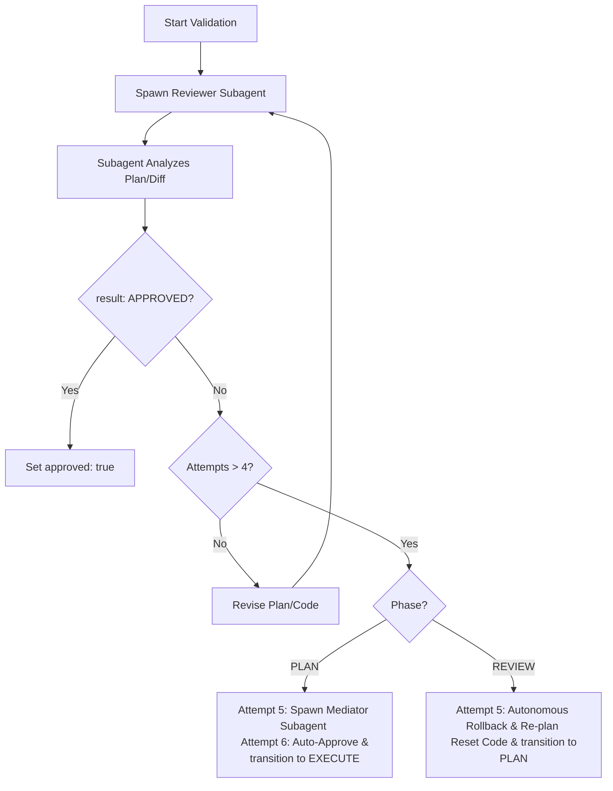

# Multi-Agent Negotiation & Rollback Protocol

This document details the multi-agent validation loops used during the PLAN and REVIEW phases in AFK mode, along with the rollback transitions for Human-in-Loop rejections.

---

## 1. AFK Negotiation Loop

In `afk` mode, the agent must not proceed without programmatically verifying the quality of the plan or the code implementation. This is achieved by spawning a reviewer subagent.



### Protocol Guidelines
- **Spawning:** The main agent spawns a `self` or a dedicated reviewer subagent.
- **Input:** The subagent is provided the ticket brief, specification, draft plan (for PLAN phase), or the git diff and review notes (for REVIEW phase).
- **Output:** The subagent must output a structured YAML payload where `result` is evaluated:
  ```yaml
  result: APPROVED  # or REJECTED
  comments:
    - "Detail of concern 1"
  ```

### Deadlock Resolution (Zero User Interaction)
To achieve zero human interaction, the agent must never degrade to `hil` or stop during AFK mode when validation loops stall. Instead, apply the following resolution protocols:

#### PLAN Phase Stalemate Resolution (Attempt 5+)
- **Attempt 5 (Mediator Resolution):** If the reviewer rejects the plan for the 4th time, the main agent spawns a `mediator` subagent. The mediator reviews the brief, spec, draft plans, and all previous reviewer comments to output a single consolidated "compromise plan". The main agent submits this plan for Attempt 5.
- **Attempt 6 (Bypass & Execute):** If the reviewer still rejects the plan on Attempt 5, the main agent bypasses reviewer rejection: it logs the planning deadlock, sets `approved: true` in the YAML record, and transitions directly to the `EXECUTE` phase. In AFK mode, the code compiler and test suite (`verify_command`) act as the final, deterministic gatekeepers of correctness.

#### REVIEW Phase Stalemate Resolution (Attempt 5)
- If the reviewer rejects the implementation for the 4th time (meaning Attempt 5 is reached), the code implementation is stuck in a stalemate. The main agent breaks the loop autonomously:
  1. **Workspace Rollback:** Execute `git reset --hard` and `git clean -fd` to completely discard the deadlocked changes and restore the workspace to a clean, known-good state.
  2. **Phase Transition:** Change the state to `PLAN` phase.
  3. **Iteration Increment:** Increment the iteration index (e.g. from `00` to `01`) and create the new YAML record at `.sdlc/issues/<ticket-id>-<new-iteration>.yaml`.
     - *Exception:* If the next iteration index would be `03` or higher (representing 3 failed full cycle attempts), trigger the **Emergency Escalation Guardrail** (see Section 2).
  4. **Plan Revision:** Append all consolidated reviewer comments from the failed attempts to the plan context as input constraints. Draft a new, simplified, step-by-step implementation strategy that avoids previous design deadlocks.
  5. **Auto-Execution:** Proceed directly to `EXECUTE` with the new plan and clean codebase.

---

## 2. Emergency Escalation Guardrails (Misclassified AFK Tasks)

To prevent resource wastage, infinite loops, and unintended side effects when a task is incorrectly marked as `afk` or contains unresolvable issues requiring human attention, the agent must enforce the following guardrails:

- **Iteration Limit Threshold:** 
  If the iteration index is about to increment to `03` (i.e. the agent has completely rolled back and re-planned 3 times), the agent must:
  1. Automatically change `mode` from `afk` to `hil` in the YAML record.
  2. Halt all automated execution.
  3. Report a detailed diagnostic summary listing all failed plans, compilation logs, and reviewer objections.
- **System and Environment Blockers:**
  If the agent encounters non-recoverable system issues (e.g. missing API keys/credentials, missing local compiler/toolchain, sandbox operation limits, or network failures that cannot be resolved autonomously), the agent must immediately degrade the task `mode` to `hil`, save the status, and stop execution to alert the developer.
- **Manual Human Override:**
  At any point during execution, the human can edit the active YAML record's `mode` key from `"afk"` to `"hil"`. The agent checks this file before starting any subphase lifecycle stage and will immediately stop when it detects the shift.

---

## 3. Human-in-Loop Rejections & Rollbacks

In `hil` mode, the human serves as the gateway for phase transitions.

- **PLAN Phase Rejection:** If the human does not approve the plan, they request modifications. The agent updates the plan in the YAML record and awaits re-approval.
- **REVIEW Phase Rejection:** If the human rejects the implementation during the REVIEW phase:
  1. The agent transitions the state back to the `PLAN` phase.
  2. The agent increments the iteration index if necessary or creates a new revision.
  3. The agent appends the human's feedback and fix instructions to the plan section.
  4. The agent goes through the `PLAN` -> `EXECUTE` -> `REVIEW` cycle again for the new items.
